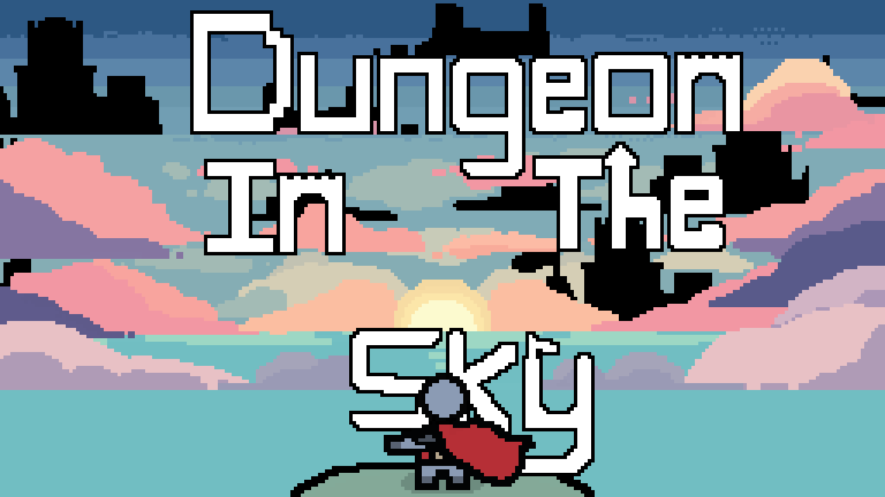
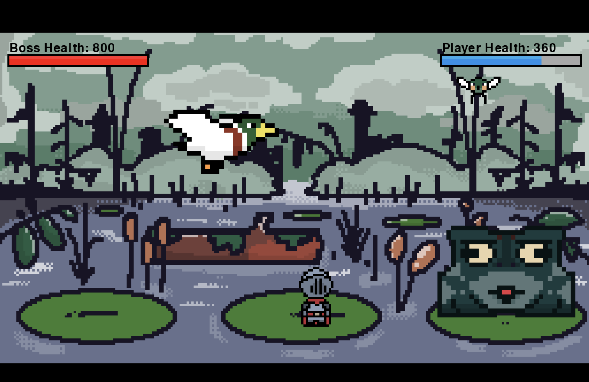
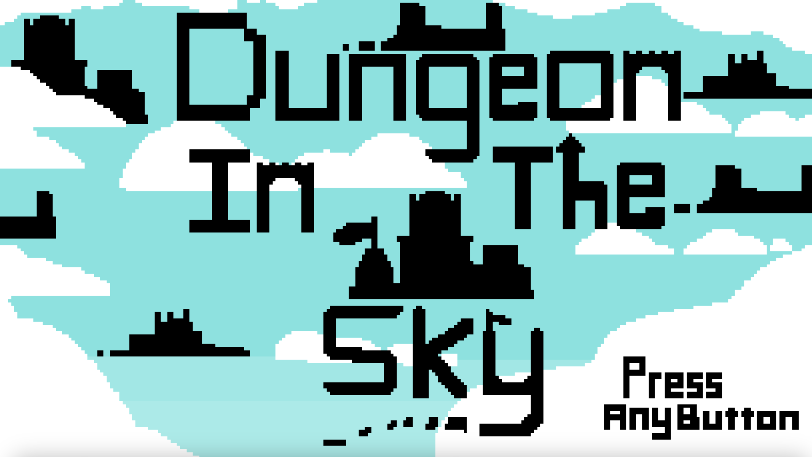

# Dungeon in the Sky

**A pixel-art boss battle adventure set high above the clouds.**  
Face monstrous foes in a forgotten sky cathedral and uncover secrets with every step. Built with Python and Pygame.

---

## Overview

Dungeon in the Sky is a hand-crafted pixel-art boss battle game with cutscenes, puzzles, and fast-paced platforming. Designed to evoke mystery and momentum, this game challenges your reflexes and curiosity alike.

---

## Download

| Platform | File |
|----------|------|
| Windows | [DungeonInTheSky-Windows.zip](https://github.com/ecruzmango/Dungeons_in_the_Sky/releases/download/v1.0.1/Dungeon.in.the.Sky.Windows.zip) |
| macOS   | [DungeonInTheSky-Mac.zip](https://github.com/ecruzmango/Dungeons_in_the_Sky/releases/download/v1.0.0/Dungeon_in_the_sky_MacOS.zip) |

> Just unzip and run.
> 
---

## Features

- **Boss-Only Combat** – Battle highly animated and reactive bosses
- **Interactive Cutscenes** – Triggered animations and intros
- **Replayable Phases** – Different behaviors based on state and progress

---

## Controls

| Action       | Key             |
|--------------|-----------------|
| Move         | Arrow Keys / WASD |
| Jump         | Spacebar        |
| Interact     | Z / Enter       |
| Pause        | Esc             |

---

## Screenshots

| Gameplay |
|----------|
|  | 
|   |
|  |
---

## 📄 License

This project is licensed under the **MIT License**.  
See [`LICENSE`](LICENSE.md) for more information.

---

## About the Developer

Created by **Erik Cruz** in 2025  
Focused on blending pixel art, procedural animation, and handcrafted level design.

Have feedback, ideas, or bugs to report?  
Submit an [Issue](https://github.com/yourusername/dungeon-in-the-sky/issues) or reach out via GitHub.

